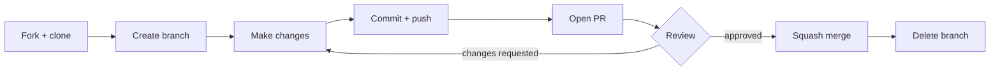

# CONTRIBUTING.md — dealroom.ai

How to make changes to this workspace. For a user guide, see
[README.md][readme]. For workspace structure and Claude's operating rules, see
[CLAUDE.md][claude-md].

---

## Roles

| Role            | Responsibilities                                        |
| --------------- | ------------------------------------------------------- |
| **Contributor** | Forks the repo, creates branches, submits pull requests |
| **Committer**   | Reviews and merges PRs, publishes new releases          |

---

## Development Workflow



### 1. Fork and clone

```bash
git clone https://github.com/<you>/dealroom.ai
cd dealroom.ai
```

### 2. Create a branch

Branch name format: `roland/<ticket-id>/<3-word-description>`

Use `ad-hoc` if there is no ticket ID:

```bash
git checkout -b roland/DR-42/add-competitor-agent
git checkout -b roland/ad-hoc/fix-prime-command
```

### 3. Open a PR early

PR title format: `<ticket-id>: <3-word-description>`

```bash
gh pr create --title "DR-42: add competitor agent" --body ""
```

### 4. Make your changes

Commit as often as it makes sense. Keep commits focused.

```bash
git add <specific-files>
git commit -m "add deep competitor analysis agent"
git push
```

### 5. Verify CI passes

```bash
gh run list --branch $(git branch --show-current)
gh run view
```

### 6. Squash merge and clean up

Once approved, committers squash-merge and delete the branch:

```bash
gh pr merge --squash --delete-branch
```

---

## What to Change and Where

### Adding a command

Commands are plain `.md` files in `.claude/commands/dealroom/`. The filename
becomes the command name (e.g., `my-command.md` → `/dealroom:my-command`).

1. Create `.claude/commands/dealroom/my-command.md`
2. Use an existing command (e.g., `build-section.md`) as a structure reference
3. Update the command table in [CLAUDE.md][claude-md] and [README.md][readme]

### Editing an agent

Agents live in `.claude/agents/`. They are specialist personas invoked by
commands.

1. Open the relevant file (e.g., `.claude/agents/market-researcher.md`)
2. Edit instructions, tone, or tool list directly
3. If adding a new MCP tool, add it to the agent's `tools:` frontmatter

### Adding an output section

The workspace has 14 sections (01–14). To add a 15th:

1. Create the output folder: `outputs/15-my-section/`
2. Create a build command: `.claude/commands/dealroom/build-section-15.md`
3. Add an entry to the sections table in [CLAUDE.md][claude-md]
4. Reference it in `build-full.md` if it should be part of the full pipeline

### Editing context or reference files

`context/` files are owned by the founder (user) — don't commit example data.
`reference/investor-benchmarks.md` is maintained by committers; update when VC
benchmark data changes.

---

## Testing

There is no automated test suite for the command `.md` files — they are
instructions for Claude, not code. Validate changes by:

1. Running the modified command in a live Claude Code session
2. Checking that outputs land in the correct `outputs/` subfolder
3. Verifying the output passes `/dealroom:investor-review`

For structural changes (new agents, new MCP integrations), verify with
`claude mcp list` and a test run of `/dealroom:prime`.

---

## Publishing (Committers Only)

This workspace does not publish packages or container images. "Publishing"
means:

- Merging to `main` — the canonical workspace used as the upstream fork source
- Tagging a release: `git tag vX.Y.Z && git push --tags`
- Updating the GitHub Pages workflow in `.github/workflows/` if the Hugo config
  changes

[readme]: README.md
[claude-md]: CLAUDE.md
