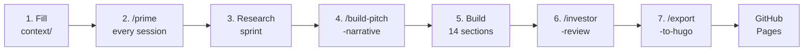

# dealroom.ai — Startup Fundraising Deal Room

A Claude Code workspace that acts as your personal fundraising research analyst.
Fill in your startup context and let Claude build a complete, investor-ready
data room: bottom-up market research, competitor analysis, 14 investor-ready
sections, a financial model, and a publishable GitHub Pages site.

> "I assume you run your company like you run your deal room. Are you clear and
> professional, or careless and sloppy?" — Richard Dulude, Underscore VC

---

## How It Works



---

## Quick Start

### 1. Fork and clone

```bash
git clone https://github.com/<you>/dealroom.ai
cd dealroom.ai
git checkout -b build
claude
```

### 2. Fill in your context

| File                             | What to fill in                             |
| -------------------------------- | ------------------------------------------- |
| `context/fundraising-stage.md`   | **Fill this first** — calibrates everything |
| `context/business-info.md`       | What your company does                      |
| `context/personal-info.md`       | About you as the founder                    |
| `context/product-description.md` | How your product works                      |
| `context/target-customer.md`     | Who you sell to                             |
| `context/current-data.md`        | Your current metrics                        |
| `context/strategy.md`            | Your fundraising goals                      |
| `context/competitors-list.md`    | Companies you compete with                  |

### 3. Prime every session

```
/dealroom:prime
```

### 4. Research sprint

```
/dealroom:research-problem
/dealroom:research-market
/dealroom:research-customer
/dealroom:research-competitors
/dealroom:research-funding
```

### 5. Build sprint

```
/dealroom:build-pitch-narrative     ← run before any sections
/dealroom:build-financial-model
/dealroom:build-section 02          ← Problem/Solution
...
/dealroom:build-section 12          ← Use of Funds
/dealroom:build-investment-memo
/dealroom:build-section 14          ← Appendix
/dealroom:build-section 01          ← Executive Summary (ALWAYS LAST)
```

Or run the full automated pipeline: `/dealroom:build-full`

### 6. Review and publish

```
/dealroom:investor-review
/dealroom:export-to-hugo
```

---

## Command Reference

| Command                                  | What It Does                               |
| ---------------------------------------- | ------------------------------------------ |
| `/dealroom:prime`                        | Load all context — run first every session |
| `/dealroom:stage-check`                  | Gap analysis vs. stage expectations        |
| `/dealroom:research-problem`             | Pain point + "Why Now" argument            |
| `/dealroom:research-market`              | Bottom-up TAM/SAM/SOM                      |
| `/dealroom:research-customer`            | ICP + acquisition channels                 |
| `/dealroom:research-hypothesis [topic]`  | General-purpose hypothesis research        |
| `/dealroom:analyze-competitor [company]` | Deep dive on one competitor                |
| `/dealroom:research-competitors`         | All competitors in parallel                |
| `/dealroom:research-funding`             | Funding comps + investor targets           |
| `/dealroom:build-pitch-narrative`        | Master narrative brief                     |
| `/dealroom:build-visual [type] [topic]`  | Investor visuals                           |
| `/dealroom:build-financial-model`        | Stage-calibrated financial model           |
| `/dealroom:build-section [01-14]`        | One data room section                      |
| `/dealroom:build-investment-memo`        | Forwardable one-pager                      |
| `/dealroom:build-full`                   | Full automated pipeline                    |
| `/dealroom:investor-review`              | 9-question + red flag audit                |
| `/dealroom:export-to-hugo`               | Publish to GitHub Pages                    |

---

## Publishing to GitHub Pages

Every `/dealroom:export-to-hugo` creates a timestamped snapshot at:

```
https://<username>.github.io/dealroom.ai/YYYY-MM-DD_HH-MM-SS/
```

Previous snapshots are never overwritten — you maintain a full history.

**First-time setup:**

1. Update `site/hugo.toml` — replace `username` with your GitHub username
2. Enable Pages: Settings → Pages → Source: "GitHub Actions"
3. Allow your working branch to deploy: Settings → Environments →
   `github-pages` → add your branch (e.g. `build`) to the allowed branches
4. Push — the workflow builds and deploys automatically

Preview locally: `cd site && hugo server`

---

## MCP Tools (Optional but Recommended)

```bash
claude mcp add perplexity --env PERPLEXITY_API_KEY="key" -- npx -yq @perplexity-ai/mcp-server
claude mcp add exa --env EXA_API_KEY="key" -- npx exa-mcp-server
claude mcp add firecrawl --env FIRECRAWL_API_KEY="key" -- npx -y firecrawl-mcp
claude mcp add napkin -- npx louischancly/napkin-ai-mcp
claude mcp add recraft --env RECRAFT_API_KEY="key" -- npx @recraft-ai/mcp
```

Full setup guide: [`reference/mcp-setup.md`][mcp-setup]

---

## Attribution

Built on [Ailtir's][ailtir] internal deal room workspace, adapted from [Liam
Ottley's][liam] Claude Code workspace template. Grounded in research from a16z,
Underscore VC, Sequoia, First Round, YC, DocSend, and 35+ VC sources.

For workspace structure and implementation details, see [CLAUDE.md][claude-md].
To contribute changes, see [CONTRIBUTING.md][contributing].

[mcp-setup]: reference/mcp-setup.md
[ailtir]: https://ailtir.com
[liam]: https://liamottley.com
[claude-md]: CLAUDE.md
[contributing]: CONTRIBUTING.md
